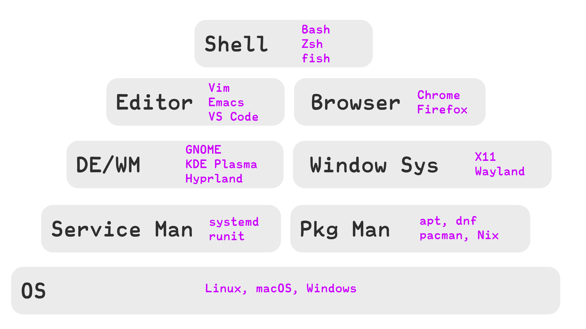

<!-- alignment: center -->
<!-- font_size: 2 -->
stdの関数でトークナイズ出来ない言語が母語の皆様におかれましてはこんばんは

---

目的
===

<!-- font_size: 2 -->
- Linuxにまつわるソフトウェアとその対立を知る
<!-- pause -->
- それらの対立からプログラマの抱える宗教問題を紐解く
<!-- pause -->
- Linuxに関するソフトウェア周辺についてなんとなく知った気になる

---

そもそもソフトウェア宗教とは
===

<!-- font_size: 2 -->
同様のレイヤーにおけるソフトウェアの対立、およびユーザーたちの対立

<!-- pause -->
具体例...

<!-- pause -->
- Editor: Vim vs Emacs
- OS: Linux vs macOS vs Windows
- systemdの是非

<!-- pause -->
>ハッカー文化においては、愛好するソフトウェアを宗教的狂信とも言える尊敬を持って扱う伝統があり... 自らの選択したエディタが最善であると信じるグループ間で数々の論争（フレーム）が発生してきた。

---

ソフトウェアを愛する
===

<!-- font_size: 2 -->
某氏の過去の問題発言s

<!-- pause -->
> Windows PCへのLinuxインストールはPCの救済, bug fix

<!-- pause -->
> one driveはMS謹製のランサム

<!-- pause -->
> WSL2はMSのWindows開発者達の陰謀

<!-- pause -->
これらの憎悪は自身のツールへの愛の裏返し  
-> 自身のツールを愛するほどに、その**敵**への憎悪は膨らむ  
-> 戦争

---

具体的には?
---

---

エディタ戦争
===

<!-- font_size: 2 -->
今は昔......

<!-- pause -->
VimというエディタとEmacsというエディタがあり、双方のユーザーはそれなりに険悪であったそうで...

今はVSCodeにユーザー数の大半を取られた(というよりは新規がVSCodeに全部流れた?)ため、過激な人は減った

---

エディタ戦争: Vim
---

<!-- font_size: 2 -->
Vimはモードという概念を持ったエディタ

<!-- pause -->
- normal: カーソル移動やコマンド操作
- insert: 文字を入力するモード

<!-- pause -->
Vimのカーソル移動における特徴として **Semantic(意味論的な)** 移動というものがある

<!-- pause -->
`次の単語`, `次の関数`, `3行下`, `今いる関数`などのような意味的な範囲で持ってカーソルを動かすことができる。

---

エディタ戦争: Emacs
---

<!-- font_size: 2 -->
Emacs lispというlisp方言を用いた無限の拡張性を持つエディタ

<!-- pause -->
メールクライアントからブラウザ, テトリスまでどんなアプリもEmacs上で動かすことができる

<!-- pause -->
=> まるでOS

<!-- pause -->
このような全部入りがUnix的でないなどの理由でVimmer等から批判を受けることも

(個人的にはEclipseとかVisual Studioとかの密結合な~~粗悪~~環境の方がよっぽど批判されるべきかと)

<!-- font_size: 1 -->
ちなみにlinusはMicroEMACSという古い最小構成のようなEmacsを使っており、彼自身がパッチを当てて使っているよう。

---

エディタ戦争: 概要
---

<!-- font_size: 2 -->
Vim -> Emacs

<!-- pause -->
- 動作が重い
- Editorの本分を忘れている
- 小指が死ぬ

<!-- pause -->
Emacs -> Vim

<!-- pause -->
- 豊かなコマンド
- Emacs Lispによる豊富なカスタマイズ性
- モーダル編集という複雑さがない

---

OS: Linux vs Windows
===

<!-- font_size: 2 -->

<!-- pause -->
- カスタム性高く、安定している **Linux**
<!-- pause -->
- 完成度は低いが、統合されたユーザー体験 **Windows**

<!-- pause -->
OSS開発は多くがmacOSやLinuxを使っているため若干Windowsは肩身の狭いイメージ

-> WSL2でだいぶ改善したようですが?

---

Systemd
===

<!-- font_size: 2 -->
Linuxにおけるサービスの管理ツール

<!-- pause -->
サービスの有効化, 起動, ログ管理などを1つで行える便利ツール

<!-- pause -->
現代Linuxにおけるサービス管理におけるデファクトスタンダード  
-> それでも批判はある

<!-- pause -->
- ログがバイナリのため専用コマンドがないとログを見れない
- `systemd`に機能を持たせすぎ -> 単一責任の原則を守ってない

なぜ多くのLinuxがsystemdを使うのか?
---

<!-- pause -->
-> 便利だから。思想より機能性が優先。

---

Systemd以外のサービスマネージャー
---

<!-- pause -->
<!-- font_size: 2 -->
- sysvinit
- Upstart
- OpenRC
- runit

<!-- pause -->
サービスマネージャーはLinuxのboot後に真っ先に起動されるソフトウェア

<!-- pause -->
-> ほぼ全てのプロセスはsystemd(など)を親として起動される
<!-- pause -->
-> 起動方法に近い

<!-- pause -->
-> Linuxは起動方法すら統一されていない

---

DE/WM
===

<!-- font_size: 2 -->

Desktop Environment / Window Manager

<!-- pause -->
Windowの制御やデスクトップ用途としての環境を提供するソフトウェア(群)

<!-- pause -->
stacking vs tilingという対立

**stacking**
<!-- pause -->

<!-- pause -->
- 従来のもの。ウィンドウを重ねて(stack)使える
- ウィンドウサイズなどの自由度は高い

<!-- pause -->
**tiling**

<!-- pause -->
- ウィンドウをタイル状に敷き詰めるタイプ。
- ウィンドウの配置などをユーザーが行う必要がない。

---

Window System
===

<!-- font_size: 2 -->

**Wayland** vs **X11**

<!-- pause -->
-> ディスプレイサーバ / コンポジタ

<!-- pause -->
- **X11**
    - クライアント-サーバー型のウィンドウシステム
    - 昔からある
<!-- pause -->
- **Wayland**はコンポジタが直接描画などを制御する
    - セキュリティが強い
    - X11との互換性がない
    - アプリ同士が独立のため連携が難しいなどのデメリットも

---

Package Manager
===

<!-- font_size: 2 -->

`apt`, `dnf`, `pacman`, `nix`などの様々なパッケージマネージャーがある

---

Shell
===

<!-- font_size: 2 -->
対話シェルやスクリプト用のShell
<!-- pause -->

- `bash`: 最強の互換性, どんなシステムにも入ってることが多い
<!-- pause -->
- `zsh`: post bash, 機能性と互換性のバランサー
<!-- pause -->
- `fish`: 五感を捨ててUX向上を目指したShell

---

Distribution
===

<!-- font_size: 2 -->

上記の対立するソフトウェアなどを選り好みして1つにバンドルしたLinux環境の配布

<!-- pause -->
-> 思想の塊

<!-- pause -->
-> 当然、火種の元

---

CUI vs GUI
===

<!-- font_size: 2 -->
どちらかといえばエンジニアと非エンジニアの対立？

<!-- pause -->
**CUI**: コマンドなどをベースにターミナル上で主に操作するUI  
<!-- pause -->
**GUI**: マウスやボタンをベースにグラフィカルに操作するUI

<!-- pause -->
- CUI(CLI)は
    - 自動化に有利
    - Agentic AIなどが扱いやすいなどのメリット
<!-- pause -->
- GUIは
    - 初見の操作に強く、誘導がしやすい

---

なぜ対立になるのか
===

<!-- font_size: 2 -->
<!-- pause -->
- ツールを選ぶ自由があるから
  - macOSにWMを切り替える方法はない
<!-- pause -->
- ツールはエコシステムだから
  - Emacsの世界はVimmerには息苦しい
<!-- pause -->
- 偏愛
  - もはやそのツールが**アイデンティティ**になっている

<!-- pause -->
-> 自身のツールを否定されるというのは**アイデンティティ**への攻撃

---

この戦争は終わるのか?
===

<!-- font_size: 2 -->
終わらない。

<!-- pause -->
Appleが全てのコンピューターを支配するとかにならない限りは

<!-- font_size: 2 -->

<!-- pause -->
- 業務や連携において害がないなら放置
- 自身で連携不可な点を解決

<!-- pause -->
**コーディングにおいてはコードがpushされれば`vim`でも`Emacs`でも`ed`でもいい**

---

Linuxソフトウェア対立概観
===

